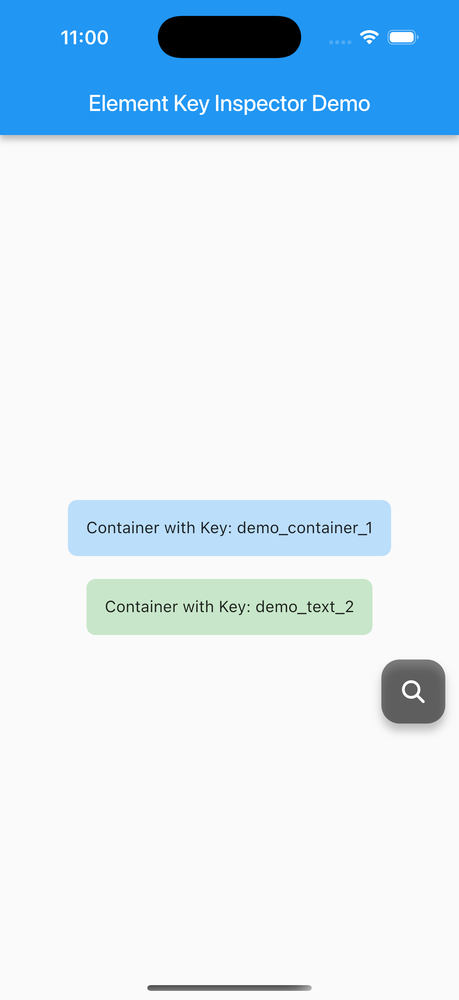
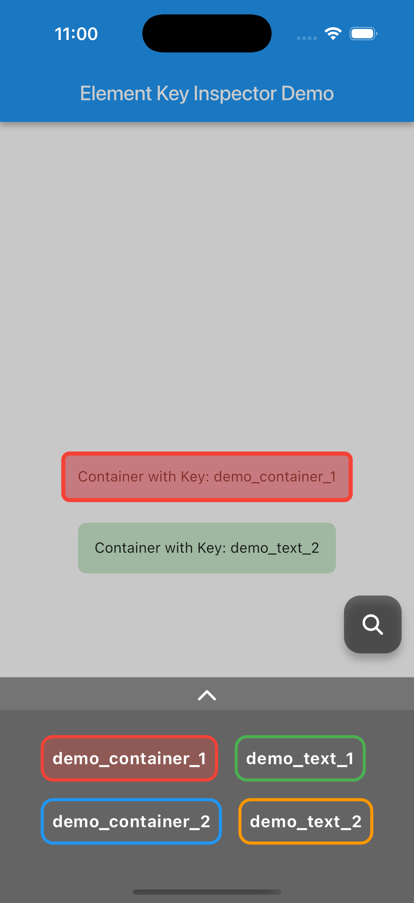

A Flutter package that allows you to visually inspect and highlight widgets by their keys in your app. Ideal for test automation workflows.

## Features

- Built-in default UI to visually inspect and highlight widgets by your keys.
- Supports custom key formats and scope filtering for flexible inspection.
- Includes a draggable floating action button to toggle the inspector overlay at runtime.

|||
|-|-|

## Installing

Add the dependency: 

```bash
$ flutter pub add element_key_inspector
```


dependencies:
  super_tooltip: latest

Import the package:

```dart
import 'package:element_key_inspector/element_key_inspector.dart';
```

## Usage

### Initialize Inspector

```dart
ElementKeyInspector.initialize(
    scopes: [ 
        // Set the scope of the element key for visibility priority and conditions
        const ElementKeyScope(
            type: MyHomePage,
            priority: ElementKeyScopePriority.hight,
        ),
    ],
    elementKeyPattern: (elementKey) {
        return elementKey.contains('demo_');
    },
);
```

### Use ElementKeyInspectorStack widget to wrap your app

```dart
ElementKeyInspectorStack(
    isShowInspectButton: true, // (Option) default: false
    inspectButton: CustomButton(), // (Option) custom inspect button
    inspectButtonPosition: Offset(300, 300), // (Option) the initial position of inspect button
    child: MaterialApp(
            ...
        )
)
```

## Additional information

### Get all the element key positions

```dart
final elementKeyPositions = ElementKeyInspector.getElementKeyPositions();
```
